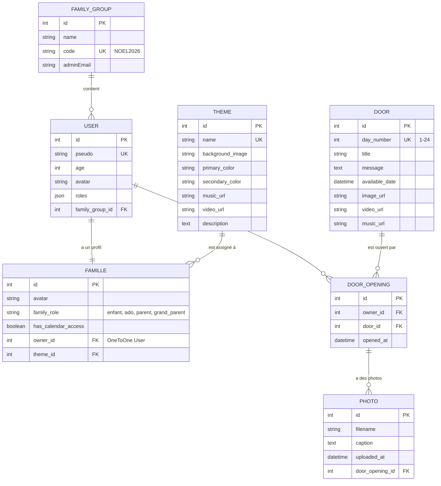

# 🗺️ Schéma ERD - Base de données Calendrier de l'Avent 2026

## 📊 Diagramme Mermaid



---

## 🔗 Relations détaillées

### 1️⃣ FamilyGroup → User (OneToMany)

**Type :** `1:N`  
**Description :** Une famille contient plusieurs utilisateurs

```sql
-- Clé étrangère
user.family_group_id → family_group.id
```

**Contraintes :**
- ✅ `NOT NULL` (un user doit appartenir à une famille)
- ✅ Cascade on delete (si famille supprimée → users supprimés)

**Exemple :**
```
FamilyGroup "Famille Noël 2026" (id: 1)
  ├── User "Khyle" (id: 1)
  ├── User "Khelyann" (id: 2)
  ├── User "Papa" (id: 3)
  ├── User "Maman" (id: 4)
  ├── User "Mamie" (id: 5)
  └── User "Papy" (id: 6)
```

---

### 2️⃣ User → Famille (OneToOne)

**Type :** `1:1`  
**Description :** Chaque utilisateur a UN profil famille

```sql
-- Clé étrangère
famille.owner_id → user.id
```

**Contraintes :**
- ✅ `UNIQUE` sur `owner_id` (1 user = 1 profil max)
- ✅ Cascade persist/remove

**Exemple :**
```
User "Papa" (id: 3)
  └── Famille (avatar: papa.png, role: parent, theme: cozy)
```

---

### 3️⃣ Theme → Famille (OneToMany)

**Type :** `1:N`  
**Description :** Un thème peut être assigné à plusieurs profils

```sql
-- Clé étrangère
famille.theme_id → theme.id
```

**Contraintes :**
- ✅ `NOT NULL` (un profil doit avoir un thème)

**Exemple :**
```
Theme "cozy" (id: 19)
  ├── Famille Papa
  └── Famille Maman
```

---

### 4️⃣ User → DoorOpening (OneToMany)

**Type :** `1:N`  
**Description :** Un utilisateur peut ouvrir plusieurs portes

```sql
-- Clé étrangère
door_opening.owner_id → user.id
```

**Contraintes :**
- ✅ `NOT NULL`
- ✅ Contrainte unique composite `(owner_id, door_id)` → Pas de doublon

**Exemple :**
```
User "Papa" (id: 3)
  ├── DoorOpening (door: 1, openedAt: 2026-12-01)
  ├── DoorOpening (door: 2, openedAt: 2026-12-02)
  └── DoorOpening (door: 3, openedAt: 2026-12-03)
```

---

### 5️⃣ Door → DoorOpening (OneToMany)

**Type :** `1:N`  
**Description :** Une porte peut être ouverte par plusieurs utilisateurs

```sql
-- Clé étrangère
door_opening.door_id → door.id
```

**Contraintes :**
- ✅ `NOT NULL`
- ✅ Contrainte unique composite `(owner_id, door_id)` → 1 user = 1 ouverture/porte

**Exemple :**
```
Door "Jour 1" (id: 1)
  ├── DoorOpening (owner: Papa, openedAt: 2026-12-01 10:30)
  ├── DoorOpening (owner: Khyle, openedAt: 2026-12-01 11:15)
  └── DoorOpening (owner: Mamie, openedAt: 2026-12-01 14:00)
```

---

### 6️⃣ DoorOpening → Photo (OneToMany) 📸

**Type :** `1:N`  
**Description :** Un DoorOpening peut avoir plusieurs photos

```sql
-- Clé étrangère
photo.door_opening_id → door_opening.id
```

**Contraintes :**
- ✅ `NOT NULL`
- ✅ Cascade on delete (si DoorOpening supprimé → photos supprimées)

**Exemple :**
```
DoorOpening "Papa - Jour 3" (id: 5)
  ├── Photo (filename: abc123.jpg, caption: "Mon sapin")
  └── Photo (filename: def456.png, caption: "Détail déco")
```

---

## 📋 Tables SQL

### family_group

| Colonne      | Type         | Contraintes                    |
|--------------|--------------|--------------------------------|
| id           | INTEGER      | PRIMARY KEY, AUTO_INCREMENT    |
| name         | VARCHAR(100) | NOT NULL                       |
| code         | VARCHAR(50)  | NOT NULL, UNIQUE               |
| admin_email  | VARCHAR(180) | NOT NULL                       |

**Index :**
- `UNIQUE INDEX` sur `code`

---

### user

| Colonne          | Type         | Contraintes                    |
|------------------|--------------|--------------------------------|
| id               | INTEGER      | PRIMARY KEY, AUTO_INCREMENT    |
| pseudo           | VARCHAR(50)  | NOT NULL, UNIQUE               |
| age              | INTEGER      | NOT NULL                       |
| avatar           | VARCHAR(255) | NOT NULL                       |
| roles            | JSON         | NOT NULL                       |
| family_group_id  | INTEGER      | NOT NULL, FK → family_group.id |

**Index :**
- `UNIQUE INDEX` sur `pseudo`
- `INDEX` sur `family_group_id`

**Clés étrangères :**
```sql
FOREIGN KEY (family_group_id) REFERENCES family_group(id) ON DELETE CASCADE
```

---

### famille

| Colonne              | Type         | Contraintes                    |
|----------------------|--------------|--------------------------------|
| id                   | INTEGER      | PRIMARY KEY, AUTO_INCREMENT    |
| avatar               | VARCHAR(255) | NOT NULL                       |
| family_role          | VARCHAR(50)  | NOT NULL                       |
| has_calendar_access  | BOOLEAN      | NOT NULL, DEFAULT TRUE         |
| owner_id             | INTEGER      | NOT NULL, UNIQUE, FK → user.id |
| theme_id             | INTEGER      | NOT NULL, FK → theme.id        |

**Index :**
- `UNIQUE INDEX` sur `owner_id`
- `INDEX` sur `theme_id`

**Clés étrangères :**
```sql
FOREIGN KEY (owner_id) REFERENCES user(id) ON DELETE CASCADE
FOREIGN KEY (theme_id) REFERENCES theme(id)
```

---

### theme

| Colonne           | Type         | Contraintes                    |
|-------------------|--------------|--------------------------------|
| id                | INTEGER      | PRIMARY KEY, AUTO_INCREMENT    |
| name              | VARCHAR(100) | NOT NULL, UNIQUE               |
| background_image  | VARCHAR(255) | NOT NULL                       |
| primary_color     | VARCHAR(7)   | NOT NULL                       |
| secondary_color   | VARCHAR(7)   | NOT NULL                       |
| music_url         | VARCHAR(255) | NULL                           |
| video_url         | VARCHAR(255) | NULL                           |
| description       | TEXT         | NOT NULL                       |

**Index :**
- `UNIQUE INDEX` sur `name`

**Valeurs :**
- `colorful_village`, `modern_snow`, `cozy`, `traditionnel`

---

### door

| Colonne         | Type         | Contraintes                    |
|-----------------|--------------|--------------------------------|
| id              | INTEGER      | PRIMARY KEY, AUTO_INCREMENT    |
| day_number      | INTEGER      | NOT NULL, UNIQUE               |
| title           | VARCHAR(100) | NOT NULL                       |
| message         | TEXT         | NOT NULL                       |
| available_date  | DATETIME     | NOT NULL                       |
| image_url       | VARCHAR(255) | NULL                           |
| video_url       | VARCHAR(255) | NULL                           |
| music_url       | VARCHAR(255) | NULL                           |

**Index :**
- `UNIQUE INDEX` sur `day_number`
- `INDEX` sur `available_date`

**Contraintes métier :**
- `day_number` entre 1 et 24

---

### door_opening

| Colonne    | Type      | Contraintes                      |
|------------|-----------|----------------------------------|
| id         | INTEGER   | PRIMARY KEY, AUTO_INCREMENT      |
| owner_id   | INTEGER   | NOT NULL, FK → user.id           |
| door_id    | INTEGER   | NOT NULL, FK → door.id           |
| opened_at  | DATETIME  | NOT NULL                         |

**Index :**
- `UNIQUE INDEX` sur `(owner_id, door_id)`
- `INDEX` sur `owner_id`
- `INDEX` sur `door_id`

**Clés étrangères :**
```sql
FOREIGN KEY (owner_id) REFERENCES user(id) ON DELETE CASCADE
FOREIGN KEY (door_id) REFERENCES door(id) ON DELETE CASCADE
```

**Contraintes métier :**
- Un user ne peut ouvrir une door qu'une seule fois

---

### photo 📸

**Nouvelle table !**

| Colonne           | Type         | Contraintes                      |
|-------------------|--------------|----------------------------------|
| id                | INTEGER      | PRIMARY KEY, AUTO_INCREMENT      |
| filename          | VARCHAR(255) | NOT NULL                         |
| caption           | TEXT         | NULL                             |
| uploaded_at       | DATETIME     | NOT NULL                         |
| door_opening_id   | INTEGER      | NOT NULL, FK → door_opening.id   |

**Index :**
- `INDEX` sur `door_opening_id`
- `INDEX` sur `uploaded_at` (pour tri galerie)

**Clés étrangères :**
```sql
FOREIGN KEY (door_opening_id) REFERENCES door_opening(id) ON DELETE CASCADE
```

**Fichier physique :**
- Stocké dans `/public/uploads/galerie/{filename}`
- Nom unique généré avec `uniqid()`

---

## 🎯 Cardinalités résumées

```
FamilyGroup (1) ←→ (N) User
User (1) ←→ (1) Famille
Theme (1) ←→ (N) Famille
User (1) ←→ (N) DoorOpening
Door (1) ←→ (N) DoorOpening
DoorOpening (1) ←→ (N) Photo 📸
```

---

## 🔒 Contraintes d'intégrité

### Uniques

1. `family_group.code` → Code famille unique (ex: NOEL2026)
2. `user.pseudo` → Pseudo unique par famille
3. `famille.owner_id` → 1 user = 1 profil max
4. `theme.name` → Nom de thème unique
5. `door.day_number` → Numéro de jour unique (1-24)
6. `door_opening (owner_id, door_id)` → 1 user ne peut ouvrir 1 porte qu'1 fois

### Clés étrangères avec CASCADE

1. `user.family_group_id` → Si famille supprimée, users supprimés
2. `famille.owner_id` → Si user supprimé, profil supprimé
3. `door_opening.owner_id` → Si user supprimé, ouvertures supprimées
4. `door_opening.door_id` → Si porte supprimée, ouvertures supprimées
5. `photo.door_opening_id` → Si DoorOpening supprimé, photos supprimées 📸

---

## 📊 Statistiques base de données

**Données de test (fixtures) :**
- 1 FamilyGroup
- 6 Users
- 6 Familles
- 4 Themes
- 24 Doors
- 0-144 DoorOpenings (selon utilisation)
- 0-N Photos (selon uploads) 📸

**Taille estimée :**
- ~1 MB avec données de test
- ~10 MB avec 1 an d'historique
- ~50-100 MB avec photos (dépend nombre uploads)

---

## 🛠️ Commandes SQL utiles

### Vérifier les relations

```sql
-- Compter les users par famille
SELECT fg.name, COUNT(u.id) as nb_users
FROM family_group fg
LEFT JOIN "user" u ON u.family_group_id = fg.id
GROUP BY fg.id;

-- Voir tous les profils avec leur thème
SELECT u.pseudo, f.family_role, t.name as theme
FROM "user" u
JOIN famille f ON f.owner_id = u.id
JOIN theme t ON f.theme_id = t.id;

-- Nombre de portes ouvertes par user
SELECT u.pseudo, COUNT(do.id) as portes_ouvertes
FROM "user" u
LEFT JOIN door_opening do ON do.owner_id = u.id
GROUP BY u.id;

-- Voir qui a ouvert quelle porte
SELECT u.pseudo, d.day_number, d.title, do.opened_at
FROM door_opening do
JOIN "user" u ON do.owner_id = u.id
JOIN door d ON do.door_id = d.id
ORDER BY d.day_number, u.pseudo;

-- Nombre de photos par user
SELECT u.pseudo, COUNT(p.id) as nb_photos
FROM "user" u
JOIN door_opening do ON do.owner_id = u.id
LEFT JOIN photo p ON p.door_opening_id = do.id
GROUP BY u.id;

-- Galerie familiale complète
SELECT 
    p.id,
    p.filename,
    p.caption,
    p.uploaded_at,
    u.pseudo as uploaded_by,
    d.day_number,
    d.title
FROM photo p
JOIN door_opening do ON p.door_opening_id = do.id
JOIN "user" u ON do.owner_id = u.id
JOIN door d ON do.door_id = d.id
ORDER BY p.uploaded_at DESC;
```

---

## 🎨 Version pour dbdiagram.io

Copie-colle ce code sur https://dbdiagram.io pour un rendu visuel interactif :

```dbml
Table family_group {
  id integer [pk, increment]
  name varchar(100) [not null]
  code varchar(50) [not null, unique]
  admin_email varchar(180) [not null]
}

Table user {
  id integer [pk, increment]
  pseudo varchar(50) [not null, unique]
  age integer [not null]
  avatar varchar(255) [not null]
  roles json [not null]
  family_group_id integer [not null, ref: > family_group.id]
}

Table famille {
  id integer [pk, increment]
  avatar varchar(255) [not null]
  family_role varchar(50) [not null]
  has_calendar_access boolean [not null, default: true]
  owner_id integer [not null, unique, ref: - user.id]
  theme_id integer [not null, ref: > theme.id]
}

Table theme {
  id integer [pk, increment]
  name varchar(100) [not null, unique]
  background_image varchar(255) [not null]
  primary_color varchar(7) [not null]
  secondary_color varchar(7) [not null]
  music_url varchar(255)
  video_url varchar(255)
  description text [not null]
}

Table door {
  id integer [pk, increment]
  day_number integer [not null, unique]
  title varchar(100) [not null]
  message text [not null]
  available_date datetime [not null]
  image_url varchar(255)
  video_url varchar(255)
  music_url varchar(255)
}

Table door_opening {
  id integer [pk, increment]
  owner_id integer [not null, ref: > user.id]
  door_id integer [not null, ref: > door.id]
  opened_at datetime [not null]
  
  Indexes {
    (owner_id, door_id) [unique]
  }
}

Table photo {
  id integer [pk, increment]
  filename varchar(255) [not null]
  caption text
  uploaded_at datetime [not null]
  door_opening_id integer [not null, ref: > door_opening.id]
  
  Indexes {
    door_opening_id
    uploaded_at
  }
  
  Note: 'Photos uploadées des défis réalisés, stockées dans /public/uploads/galerie/'
}
```

---

## 📝 Changelog BDD

### Version 2.1.0 (1er janvier 2026)
- ✨ **Table `photo` ajoutée**
- ✨ Relation Photo → DoorOpening (ManyToOne)
- ✨ Index sur `door_opening_id` et `uploaded_at`
- ✨ CASCADE on delete

### Version 2.0 (1er janvier 2026)
- ✨ Table `family_group` ajoutée
- ♻️ Table `user` refactorisée (suppression email/password)
- ✨ Relation FamilyGroup → User
- ✨ 6 tables au total

### Version 1.0 (Décembre 2025)
- ✨ 5 tables initiales
- ✨ Relations OneToOne, OneToMany, ManyToOne
- ✨ Contraintes d'intégrité

---

**Dernière mise à jour : 1er janvier 2026 - 22h40**
**7 tables | 6 relations | Upload photos ✅**